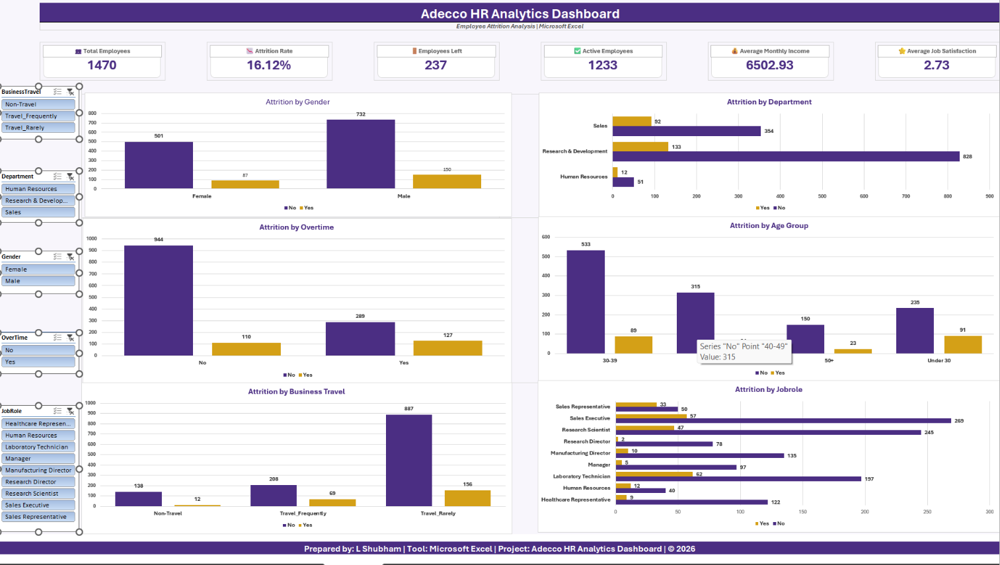

# Adecco-HR-Analytics-Excel-Project
Interactive HR Analytics Dashboard built in Microsoft Excel to analyze employee attrition using Pivot Tables, Charts, Slicers, and Business Insights.
# 👥 Adecco HR Analytics | Employee Attrition Analysis

<p align="center">


</p>

---

# 📌 Project Overview

Employee attrition is one of the biggest challenges faced by organizations. High employee turnover increases recruitment costs, affects productivity, and impacts overall business performance.

This project analyzes employee attrition using **Microsoft Excel** by transforming raw HR data into meaningful business insights through **Pivot Tables, Pivot Charts, Interactive Slicers, KPI Cards, and Dashboard Visualizations**.

The final dashboard enables HR professionals and business leaders to quickly identify workforce trends and make informed decisions to improve employee retention.

---

# 🎯 Business Objective

The primary objectives of this project are:

- Analyze employee attrition trends
- Identify departments with higher employee turnover
- Study the impact of overtime, business travel, age, gender and job roles
- Build an interactive HR dashboard
- Generate business insights for better workforce planning

---

# 📊 Dashboard Preview

<p align="center">



</p>

---

# 📈 Dashboard KPIs

| KPI | Description |
|------|-------------|
| 👥 Total Employees | Total workforce |
| 📉 Attrition Rate | Percentage of employees who left |
| 🚪 Employees Left | Total attrition count |
| ✅ Active Employees | Current employees |
| 💰 Average Monthly Income | Average employee salary |
| ⭐ Average Job Satisfaction | Overall satisfaction score |

---

# 📊 Dashboard Features

✔ Interactive KPI Cards

✔ Pivot Tables

✔ Pivot Charts

✔ Dynamic Slicers

✔ Business Insights

✔ Executive Summary

---

# 🎛 Dashboard Filters

The dashboard can be filtered using:

- Department
- Business Travel
- Gender
- OverTime
- Job Role

---

# 📉 Visualizations Included

- Attrition by Department
- Attrition by Gender
- Attrition by Overtime
- Attrition by Age Group
- Attrition by Business Travel
- Attrition by Job Role

---

# 📂 Dataset Information

| Attribute | Details |
|------------|---------|
| Dataset | IBM HR Employee Attrition Dataset |
| Source | Kaggle |
| Records | 1,470 |
| Features | 35 |
| Tool | Microsoft Excel |

---

# 🛠 Tools Used

- Microsoft Excel
- Pivot Tables
- Pivot Charts
- Slicers
- Conditional Formatting
- Excel Functions
- Dashboard Design

---

# 🔄 Project Workflow

```text
Raw Dataset
      │
      ▼
Data Cleaning
      │
      ▼
Helper Columns
      │
      ▼
Pivot Tables
      │
      ▼
Interactive Dashboard
      │
      ▼
Business Insights
```

---

# ❓ Business Questions Answered

### Basic Analysis

- What is the overall employee attrition rate?
- Which department has the highest attrition?
- How does attrition vary by gender?
- Which age group experiences the highest attrition?
- Which job role has the highest employee turnover?
- Does overtime affect employee attrition?
- How does business travel influence attrition?
- What is the relationship between stock option level and attrition?
- What is the average monthly income by attrition status?
- How does job satisfaction differ between employees who stayed and left?

---

### Medium Analysis

- Department-wise attrition trends
- Overtime impact on employee turnover
- Monthly income comparison
- Job role attrition analysis
- Stock option effectiveness
- Work-life balance comparison
- Employee tenure analysis
- Business travel impact
- Promotion trends
- HR performance insights

---

# 💡 Key Insights

- Overall employee attrition rate is **16.12%**.
- Employees working overtime are significantly more likely to leave.
- Research & Development and Sales contribute the largest number of attrition cases.
- Certain job roles experience noticeably higher turnover.
- Employees without stock options show higher attrition.
- Business travel appears to influence employee retention.

---

# 📁 Repository Structure

```text
Adecco-HR-Analytics-Excel-Project
│
├── Dashboard
│   └── Dashboard_Workbook.xlsx
│
├── Dataset
│   ├── Raw_Dataset.xlsx
│   └── Cleaned_Dataset.xlsx
│
├── Images
│   └── HR_Dashboard.png
│
└── README.md
```

---

# 🚀 Skills Demonstrated

- Data Cleaning
- Data Preparation
- Excel Reporting
- HR Analytics
- Data Visualization
- Interactive Dashboards
- Pivot Tables
- Pivot Charts
- Business Intelligence
- Analytical Thinking

---

# 📚 Learning Outcomes

Through this project, I strengthened my skills in:

- Microsoft Excel
- Dashboard Development
- Data Analysis
- Business Problem Solving
- HR Analytics
- Interactive Reporting

---

# 👨‍💻 About Me

**L Shubham**

📧 Email: **shubham.lingamm@gmail.com**

🔗 LinkedIn: **https://www.linkedin.com/in/shubham-lingam**

💻 GitHub: **https://github.com/shubham-lingam**

---

## ⭐ If you found this project helpful, please consider giving it a Star!
